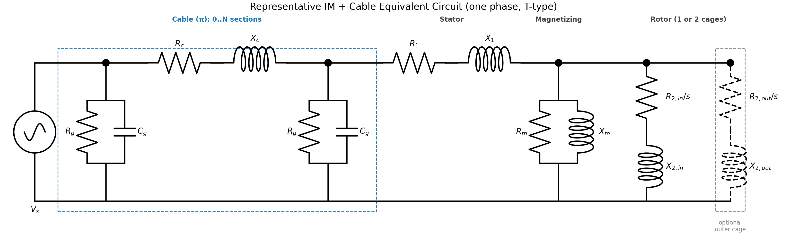
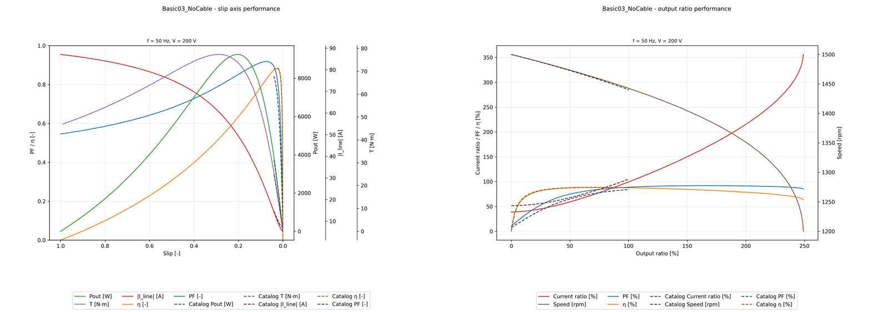
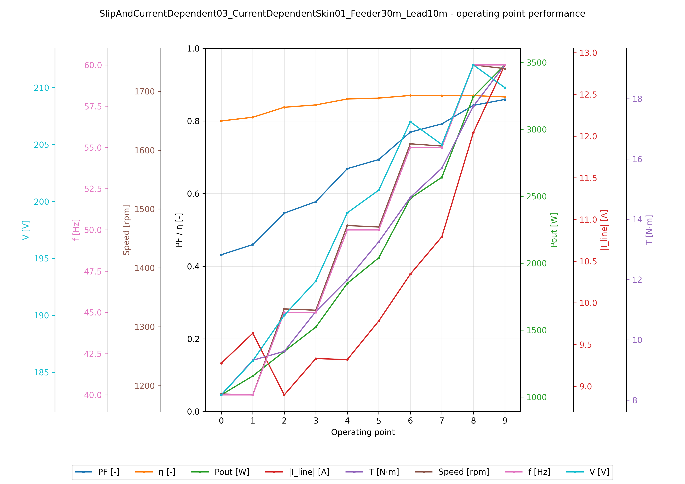

# im-cable-system

**誘導電動機（IM）＋ケーブル系の等価回路シミュレーション／パラメータ推定エンジン**です。
メーカー等の性能曲線（パフォーマンスカーブ）しか手元にない場合でも、
等価回路パラメータを推定し、ケーブル込み・定格外条件の性能特性
（電流・出力・力率・効率など）を評価できます。

## What this solves

ポンプ・ファン等の IM システムでは、メーカー曲線は多くの場合「定格条件・ケーブルなし」の
性能情報として提供されます。本リポジトリは、その曲線を起点に
**再利用可能な等価回路モデル**を同定し、実ケーブルや任意の運転点を含む解析へ
つなげるためのエンジンです。

- **入力**: 性能曲線 CSV/TSV、IM・ケーブルの系列カタログ、推定設定、運転条件。
- **出力**: 推定済み catalog YAML、性能表 CSV、catalog vs sim 図 PNG、収束・数値安定化レポート。
- **主な用途**: カタログ曲線へのモデルフィット、ケーブル込み順方向解析、定格外条件の感度確認、モデル追加・比較。

## Overview

代表構成として、π型ケーブルと T 型 IM 等価回路を 1 相分で示します。
各インピーダンスは一定値（`BASIC`）に限らず、**励磁飽和・表皮効果・漏れ磁束飽和**などを
考慮した**インピーダンス可変モデル**として構築できます。現状は slip／電流／周波数依存に
対応しています（その他依存モデルは拡張可能な設計）。ケーブル有無、T/L 型、
単一かご／二重かごの切替も含め、入力設定で指定できます。



## Features

### 実行モード

- **EstimateParams（推定）**: 性能曲線（電流・出力・力率・効率）に等価回路パラメータをフィッティングする。トルク列は回転速度と組み合わせて出力へ変換して利用可能。項目ごとの重み・正規化・収束診断を設定可能。
- **ForwardByCartesianGrid（順方向・直積グリッド）**: `slip × 周波数 × 線間電圧` の全組合せで性能特性を計算する。
- **ForwardByOperatingPoints（順方向・運転点指定）**: 指定した運転点の集合について性能特性を計算する。

### 共通機能

- **複数の等価回路モデル**: 一定値（`BASIC`）のほか、励磁飽和・表皮効果・漏れ磁束飽和を考慮した slip／電流／周波数依存のインピーダンス可変モデルを構築でき、ケーブル有無・T/L 型・単一かご／二重かごも切替可能。
- **可視化・出力**: 推定／フォワード結果を図（PNG）・表（CSV）で出力する。カタログ曲線があれば重ね描き（catalog vs sim）で比較でき、カタログがなくても Forward 系は結果を出力できる。

## Quick Start

リポジトリを clone し、[Installation](#installation) の「開発する場合」に従って
開発用インストール（`pip install -e ".[dev]"`）を済ませた状態で、リポジトリの
ルートから実行してください。デモ出力は実行モードごとに
`examples/outputs/<mode>/` に保存されます。

まず動作を見る場合は、下の 3 コマンドを上から順に実行すると、
「順方向解析 → パラメータ推定 → 運転点解析」の代表出力を確認できます。

### ForwardByCartesianGrid

```bash
MPLBACKEND=Agg .venv/bin/python runner/run_forward_by_cartesian_grid.py \
  --series-selection examples/input/series_cartesian_grid.csv \
  --axes examples/input/axes_cartesian_grid.csv \
  --performance-curve examples/input/performance_curve.csv \
  --config examples/config/forward_by_cartesian_grid.yaml \
  --im-catalog src/im_cable_system/catalog/im_series_catalog.yaml \
  --cable-catalog src/im_cable_system/catalog/cable_series_catalog.yaml
```

### EstimateParams

`examples/input/estimate_params_input.csv` の ``model_candidate_axis`` は各軸 1 候補
（`SlipAndCurrentDependent03` 相当の正解構造のみ、1 組み合わせ）に絞ってあり、
Quick Start の計算時間を短縮しています。構造同定デモは ``candidate_2`` 以降に
候補を追加すると直積展開されます（パイプライン通しテスト参照）。

```bash
MPLBACKEND=Agg .venv/bin/python runner/run_estimate_params.py \
  --input examples/input/estimate_params_input.csv \
  --config examples/config/estimate_params.yaml \
  --im-bounds src/im_cable_system/bounds_and_init/im_descriptor_bounds_and_init.yaml \
  --cable-bounds src/im_cable_system/bounds_and_init/cable_descriptor_bounds_and_init.yaml
```

### ForwardByOperatingPoints

```bash
MPLBACKEND=Agg .venv/bin/python runner/run_forward_by_operating_points.py \
  --series-selection examples/input/series_operating_points.csv \
  --axes examples/input/axes_operating_points.csv \
  --config examples/config/forward_by_operating_points.yaml \
  --im-catalog src/im_cable_system/catalog/im_series_catalog.yaml \
  --cable-catalog src/im_cable_system/catalog/cable_series_catalog.yaml
```

> Forward 系 runner は 1 コマンド = 1 ジョブです。複数ジョブをまとめて実行する場合は、[Usage](#usage) のように pipeline へ複数の `ForwardJobSpec` を束ねた `ForwardJobSpecs` を渡してください。

## Installation

### 必要条件

- Python 3.10 以上（`pyproject.toml` の `requires-python` に準拠）
- 推奨: 仮想環境（`.venv`）

### 使う場合（ライブラリとして組み込む）

自分のプロジェクトの仮想環境に直接インストールします。

```bash
pip install "git+https://github.com/RenjiKujo/im-cable-system.git"
```

### 開発する場合（モデル追加・PR、または使いながら拡張）

clone して editable インストールします。ソース編集が即反映され、そのまま PR も出せます。

```bash
git clone https://github.com/RenjiKujo/im-cable-system.git
cd im-cable-system
python -m venv .venv
source .venv/bin/activate   # Windows: .venv\Scripts\activate
pip install -U pip
pip install -e ".[dev]"
```

> 自分のパイプラインで使いながら拡張したい場合は、`.venv` を**自分のプロジェクト側**に作り、`pip install -e "/path/to/im-cable-system[dev]"` のように clone 先を指定してインストールします。

## Usage

### パッケージの import

自分のパイプラインへ組み込む場合は、各機能の**ファサード窓口**
（外部利用者向けの import 入口）から `Pipeline` と対応する `JobSpec` を import します。

```python
# Forward（直積グリッド）
from im_cable_system.forward_by_cartesian_grid import (
    ForwardByCartesianGridPipeline,
    ForwardJobSpec,
    ForwardJobSpecs,
)

# Forward（運転点指定）
from im_cable_system.forward_by_operating_points import (
    ForwardByOperatingPointsPipeline,
    ForwardJobSpec,
    ForwardJobSpecs,
)

# EstimateParams（推定）
from im_cable_system.estimate_params import (
    EstimateParamsPipeline,
    EstimateParamsJobSpec,
)
```

### 設定ファイル・同梱カタログ

- アプリケーション設定の例: `src/im_cable_system/engine/shared/config/config.yaml`
- Forward 用の IM／ケーブル系列カタログを `src/im_cable_system/catalog/` に同梱。
- EstimateParams 用のパラメータ境界・初期値を `src/im_cable_system/bounds_and_init/` に同梱。
- カタログ／境界・初期値 YAML のパスは、CLI 引数（`--im-catalog` など）を優先し、未指定なら同梱 `config.yaml` の相対パス参照を使います（どちらも未指定だと `ValueError`）。

## Inputs / Outputs

表形式ファイルは TSV / CSV のどちらでも可。

- **EstimateParams**: 統合入力表（シリーズ選択・名盤・性能曲線・推定設定）を入力し、推定モデル catalog YAML、fit 要約 CSV、catalog vs sim 図、数値安定化 CSV を出力。
- **ForwardByCartesianGrid**: シリーズ選択表と `slip × 周波数 × 線間電圧` の直積グリッド表を入力し、性能曲線図 PNG と表 CSV を出力。性能曲線表は重ね描き用に任意指定。
- **ForwardByOperatingPoints**: シリーズ選択表と運転点表を入力し、運転点ごとの性能図 PNG と表 CSV を出力。性能曲線表は任意指定。

## Examples

以下の 3 図は、メーカー性能曲線を起点に「課題 → 解決 → 活用」を
一気通貫で示します。README を初めて読む場合は、この節を見ると
本エンジンで何ができるかを最短で把握できます。

1. **課題**: メーカーのパフォーマンスカーブは、インピーダンス一定の
   IM 等価回路では再現できない（特に高電流・高出力比域で乖離）。
2. **解決**: 可変インピーダンスだけでなくインピーダンスモデルのパラメータも推定し、性能曲線に一致させる。
3. **活用**: フィット済み IM モデルに実ケーブルを付け、定格外の現実的な
   運転条件で解析する。

**1. 課題: メーカー曲線とインピーダンス一定モデルの乖離**



> **課題の裏付け。** 破線はメーカー性能曲線に見立てた教師データ（4 極・50 Hz・200 V、回転数 1500→1440 rpm＝slip 0〜4 %）、実線はインピーダンス一定の簡易 IM モデル `Basic03` の再計算結果です。簡易モデルは飽和・漏れ・表皮効果の slip／電流依存を表現できず、力率・効率・電流の形が破線から離れます。

**2. 解決: 可変インピーダンスモデルで性能曲線に一致**


> **解決の裏付け。** 教師曲線に対し `EstimateParams` で IM パラメータを推定します。``model_candidate_axis`` に複数候補を列挙すると構造同定も可能で、誤構造（`Basic03`）の残差 RMSE は約 `2×10⁻⁴`、正構造は約 `2×10⁻⁶` と桁違いです（パイプライン通しテストで検証）。図2は正解構造でフォワード再計算した実線が教師破線と一致する例です（図の再生成はカタログ正解 `SlipAndCurrentDependent03` のフォワードを使用）。

**3. 活用: フィット済みモデル＋ケーブルで現実的な運転条件を解析**



> **活用の裏付け。** 図2までで得た IM モデル（本デモではその代理としてカタログ正解 `SlipAndCurrentDependent03`）に、現場相当のケーブル（幹線 30 m＋引込 10 m、電流依存の導線インピーダンス）を接続し、定格外の電圧・周波数・slip を 10 運転点で指定して順計算（`ForwardByOperatingPoints`）しました。横軸は運転点の時系列で、後半ほど slip が増えるシナリオ（負荷増・摩耗の模擬）として、ケーブル込みの力率・効率・電流などを評価できます。

> 上 3 図の再生成手順は末尾の「README 図の再生成」を参照してください。

## 設計ハイライト

「定格・ケーブルなし」のメーカー性能曲線を、モデル同定と順方向解析を通じて、**定格外条件・長尺ケーブル込みでも評価できる再利用可能なエンジン**に変換することを目的に、拡張性と保守性を重視して設計しています。

- **依存方向を構造で固定**: `pipeline → processor → algorithm → domain → shared` の一方向依存を、公開窓口（ファサード）と層別 import 規約で守る。インターフェース＋ファクトリーで実装を差し替え可能にしている。
- **Stage × DTO でプロセスとデータ契約を分離**: 実行を Input / Execute / Output の独立した Stage として連鎖させ、入力原値・モデル/計算中間・出力用を `InputDto` / `ItmDto` / `OutputDto` に分離。実行モードごとの差分を局所化し、Stage 間のデータ契約を明確にしている。
- **設定駆動で拡張・再現**: 等価回路におけるインピーダンスを `BASIC`（一定）から slip／電流／周波数依存まで設定で切替でき、新しい依存モデルは下位層に追加するだけで上位の pipeline・CLI は無改修（拡張に開き、変更に閉じた Open-Closed 原則）。設定から対応するモデルオブジェクトを生成し、パラメータの不足・不一致は検証で弾く。
- **数値と契約の二段で破綻を防ぐ**: ゼロ除算や極大/極小値を `eps` / `max_mag` で統一的に clamp し、特異点に近い条件も診断付きで評価できる（発火は数値安定化イベントとして出力 DTO / レポートに記録）。加えて入力（単位・配列軸・ケーブル/IM 契約）、実行（エネルギー保存・電流/電圧レンジ）、DTO 契約（形状・有限性・`P = Tω`）と、各ステージに自己整合性チェックを備え、実装ミスや設定ズレを早期に弾く。
- **テストと CI で保守性を担保**: 型ヒントを全面導入し、`domain / algorithm / processor / pipeline / shared` の各層に対応する 150 本超・1,000 件規模のユニットテストと、実行モード別のパイプライン通しテストを整備。`ruff`（lint/format）・`pyright`（型）・`pytest` を CI（GitHub Actions）で検証して、チームでの変更に耐える構成にしている。

> 設計の詳細は [Documentation](#documentation) を参照してください。

## Development

### CI / テスト

PR と `main` への push で、lint（ruff）・型（pyright）・テスト（pytest）を
GitHub Actions で検証しています（`.github/workflows/ci.yml`）。
テストは `domain / algorithm / processor / pipeline / shared` の各層に対応する
単体テストと、各実行モードのパイプライン通しテストで構成しています。

手元でも CI と同じチェックを再現できます。

> 正本は `.github/workflows/ci.yml`。以下は手元で打つためのクイックリファレンス。

```bash
ruff format --check src tests   # 整形チェック
ruff check src tests            # lint
basedpyright                      # 型
pytest -m "not slow" -q         # テスト（CI と同じ。slow を除外）
```

slow を含む全テストは `pytest -q` で実行できます。

## Documentation

設計意図・前提条件は `docs/` にまとめています（コードから読めない「なぜ」を中心に記述）。

- **等価回路モデルの数式 ↔ YAML キー ↔ 実装の対応**: [docs/model_equations/index.md](docs/model_equations/index.md) — 本プロジェクトの差別化点。等価回路の各インピーダンスモデルの数式と、設定 YAML の係数キー、実装コードを 1 対 1 で対応づけた索引。
- **メーカー曲線が完全には合わない理由（EstimateParams）**: [docs/estimate_params_curve_fitting_consistency.md](docs/estimate_params_curve_fitting_consistency.md) — 4 量の過剰決定・カタログ側の非整合・残差重みの推奨段取り。
- 入口・俯瞰・目次: [docs/README.md](docs/README.md)
- アーキテクチャ（層別設計）: [docs/architecture/](docs/architecture/)
- Algorithm 層（input / execute / output）の設計: [docs/architecture/3_algorithm.md](docs/architecture/3_algorithm.md)（詳細: [docs/architecture/algorithm/](docs/architecture/algorithm/)）
- Processor 層の設計: [docs/architecture/4_processor.md](docs/architecture/4_processor.md)
- DTO 設計方針: [docs/architecture/shared/dto_principle.md](docs/architecture/shared/dto_principle.md)

## README 図の再生成

README に掲載している図は以下のコマンドで再生成できます（`.venv` を有効化したリポジトリルートで実行）。

### 等価回路図

```bash
MPLBACKEND=Agg .venv/bin/python scripts/generate_circuit_diagram.py
```

### 教師性能曲線（examples 入力）

`examples/input/performance_curve.csv` と `estimate_params_input.csv` の教師曲線は、
カタログ `SlipAndCurrentDependent03`（全枝 α=0.6）のフォワード結果から生成します（50 Hz / 200 V、
回転数 1500→1440 rpm、slip 0〜4 %、1.5 rpm 刻み・41 点）。推定の bounds は
`im_descriptor_bounds_and_init.yaml` で該当モデルの ``alpha_*`` のみ ``ub: 1.0`` に拡張済みです。

```bash
MPLBACKEND=Agg .venv/bin/python scripts/generate_example_teacher_curve.py
# estimate_params_input.csv の曲線部を performance_curve.csv と同期（ヘッダ 26 行維持）
.venv/bin/python - <<'PY'
from pathlib import Path
perf = Path("examples/input/performance_curve.csv").read_text(encoding="utf-8").splitlines()
curve_start = next(i for i, line in enumerate(perf) if line.startswith("rotational_speed,"))
header = Path("examples/input/estimate_params_input.csv").read_text(encoding="utf-8").splitlines()[:26]
Path("examples/input/estimate_params_input.csv").write_text(
    "\n".join(header) + "\n" + "\n".join(perf[curve_start:]) + "\n",
    encoding="utf-8",
)
PY
```

### 性能曲線・推定フィット図

Quick Start の Forward / EstimateParams を実行後、合成スクリプトで README 用 PNG を更新します。

```bash
# 図1: Basic03 フォワード（教師 = SACD03 カタログ曲線）
MPLBACKEND=Agg .venv/bin/python runner/run_forward_by_cartesian_grid.py \
  --series-selection examples/input/series_cartesian_grid.csv \
  --axes examples/input/axes_cartesian_grid.csv \
  --performance-curve examples/input/performance_curve.csv \
  --config examples/config/forward_by_cartesian_grid.yaml \
  --im-catalog src/im_cable_system/catalog/im_series_catalog.yaml \
  --cable-catalog src/im_cable_system/catalog/cable_series_catalog.yaml
.venv/bin/python scripts/combine_axis_figures.py \
  --figures-dir examples/outputs/forward_by_cartesian_grid/figures \
  --name-contains Basic03 \
  --output docs/assets/forward_basic03_vs_slipandcurrentdependent03.png

# 図2: SACD03 フォワード（図1と同じ axes・教師曲線）
MPLBACKEND=Agg .venv/bin/python scripts/generate_estimate_params_readme_figure.py
```

### 運転点解析図

`examples/input/series_operating_points.csv` はカタログ正解 IM ＋ `CurrentDependentSkin01` 導線モデルです。Quick Start 実行後、最新 PNG をコピーします。

```bash
MPLBACKEND=Agg .venv/bin/python runner/run_forward_by_operating_points.py \
  --series-selection examples/input/series_operating_points.csv \
  --axes examples/input/axes_operating_points.csv \
  --config examples/config/forward_by_operating_points.yaml \
  --im-catalog src/im_cable_system/catalog/im_series_catalog.yaml \
  --cable-catalog src/im_cable_system/catalog/cable_series_catalog.yaml
cp "$(ls -t examples/outputs/forward_by_operating_points/figures/fig_operating_points_*.png | head -n 1)" \
  docs/assets/operating_points_slipandcurrentdependent03_cable.png
```
