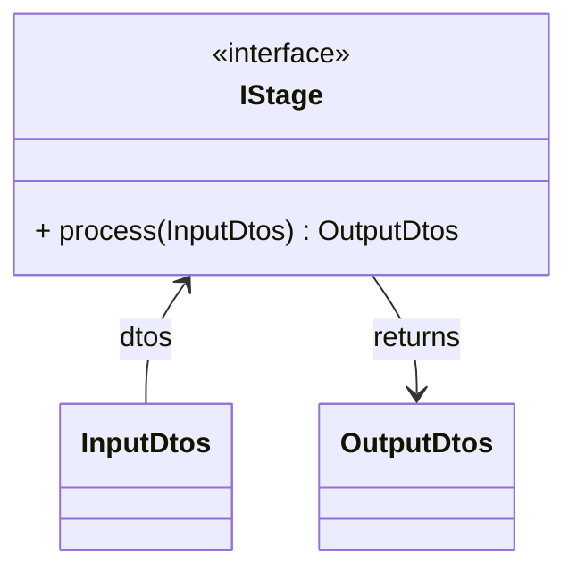

# シミュレーションロジック設計 - コンポーネント構成

## コンポーネント構成概要

本ドキュメントは、本シミュレーションエンジンにおけるコンポーネント構成について記載する。

### レイヤー構造
```
pipeline → processor → algorithm → domain → shared
```

Simulationエンジンでは上記のレイヤー構造を採用する。

### 各コンポーネントの役割

| コンポーネント | 役割 | 依存先 |
|---------|------|--------|
| **pipeline** | パイプライン全体の制御・実行管理と、各ステージの実行順序の管理。入出力は Dtos で統一する | processor, algorithm, domain, shared |
| **processor** | 各ステージ（Input/Execute/Output）で **Dtos** の受け渡しと処理フローを担当する。Dtos を走査し、各要素（単一 Dto）に対する処理は Algorithm 層に委譲し、結果を集約して返す。各 Dto ごとに Algorithm のオーケストレーターを 1 回呼び、処理の詳細順序は Algorithm 層に閉じる。各ステージの引数・戻り値は Dtos で、層・ステージごとに完全に定義される | algorithm, domain, shared |
| **algorithm** | 各ステージにおいて **単一 Dto** を引数に取り、1 本の結果 Dto（または 1 件分の出力）を返すコアロジック（モデル構築・シミュレーション実行・検証・可視化用データ生成等）を実装する。引数・戻り値は層・ステージごとに完全に定義される | domain, shared |
| **domain** | シミュレーションで使用する基礎知識・物理法則に基づく計算・判定・検証を提供する | shared |
| **shared** | 全コンポーネントで共通利用されるデータ構造（DTO）・ユーティリティ・定数・設定を提供する | なし |

## 各コンポーネントの詳細設計

各コンポーネントの詳細設計については、以下のドキュメントを参照してください：

- **pipeline**: `5_pipeline.md`
- **processor**: `4_processor.md`
- **algorithm**: `3_algorithm.md`
- **domain**: `2_domain.md`
- **shared**: `1_shared.md`

## ディレクトリ構成（コンポーネントと一致）

### 設計方針
本設計では、**コンポーネント構成とディレクトリ構成を一致**させている。よって、依存関係は、コンポーネント間の依存関係と完全に一致している。
これにより、以下の利点が得られる：

- **責務の明確化**: 各ディレクトリが対応するコンポーネントの責務を明確に表現
- **依存関係の可視化**: ディレクトリ構造からコンポーネント間の依存関係が理解しやすい
- **保守性の向上**: コンポーネントの変更がディレクトリ構造に直接反映される
- **開発効率の向上**: 開発者がコンポーネントの場所を直感的に把握できる

### ディレクトリ構成

```
src/im_cable_system/engine/
├── pipeline/                    # パイプライン制御・実行管理
├── processor/                   # ステージ処理（Dtos の走査・集約）
│   ├── input_stage/             # 入力ステージ
│   ├── execute_stage/           # 実行ステージ
│   └── output_stage/            # 出力ステージ
├── algorithm/                   # シミュレーションアルゴリズム実装
│   ├── input_algorithm/         # Inputステージ用アルゴリズム
│   ├── execute_algorithm/       # Executeステージ用アルゴリズム
│   └── output_algorithm/        # Outputステージ用アルゴリズム
├── domain/                      # 基礎知識・物理法則提供
│   ├── numerics/                # 配列・数値ユーティリティ
│   ├── physics/                 # 物理計算（電気回路・特性値）
│   ├── predicate/               # 状態・条件判定（bool）
│   └── validation/              # 物理法則・制約検証（例外）
└── shared/                      # 共通要素（DTO・設定・ジョブ仕様・数値安定化など）
    ├── dto/                     # データ転送オブジェクト
    ├── config/                  # 設定・ロガー
    ├── job_spec/                # 実行モード別ジョブ仕様
    └── numerical_stability/     # 数値安定化イベント集計
```

## コンポーネントの依存関係

### 依存関係の方向
```
pipeline
  ↓
processor
  ↓
algorithm
  ↓
domain
  ↓
shared
```

### 依存関係の詳細

#### pipeline → processor, algorithm, domain, shared
- pipelineはprocessorのインターフェイスに依存
- pipelineはalgorithmのインターフェイスに依存（直接参照はしないが、processor経由で使用）
- pipelineはdomainのインターフェイスに依存（直接参照はしないが、processor経由で使用）
- pipelineはsharedのDTO、ユーティリティ、設定に依存

詳細は`5_pipeline.md`を参照。

#### processor → algorithm, domain, shared
- processorはalgorithmのインターフェイスに依存（Strategy Pattern）
- processorはdomainのインターフェイスに依存（判定処理、計算ロジック、検証ルールの取得）
- processorはsharedのDTO、ユーティリティ、設定に依存

詳細は`4_processor.md`を参照。

#### algorithm → domain, shared
- algorithmはdomainのインターフェイスに依存（判定処理、計算ロジック、検証ルールの利用）
- algorithmはsharedのDTO、ユーティリティ、設定に依存

詳細は`3_algorithm.md`を参照。

#### domain → shared
- domainはsharedのDTO、ユーティリティ、設定に依存

詳細は`2_domain.md`を参照。

#### shared
- sharedは他のコンポーネントに依存しない

詳細は`1_shared.md`を参照。

### 依存関係の原則
- **上位レイヤーから下位レイヤーへの一方向依存**: 下位レイヤーは上位レイヤーに依存しない
- **インターフェイスへの依存**: 具象クラスではなくインターフェイスに依存（依存性逆転の原則）
- **DTOを介したデータ受け渡し**: 各ステージ間でDTOを介した明確なデータ受け渡し

**インポートルール**（層間依存・import 禁止パターン）と **Dir・`__init__.py` 運用**は [`docs/rules/layering_and_imports.md`](../rules/layering_and_imports.md) を参照する。各コンポーネントのフォルダ構成は本ドキュメント群の `*_*.md` を参照する。

## 図の表記ルール（Mermaid クラス図）

本設計ドキュメント群では、コンポーネント間の入力・出力・依存を Mermaid のクラス図で示す。

### 矢印の向き

- **入力（データが流れ込む）**: 「データ源 → 受け手」を表すため、**受け手を左**に書く。`受け手 <-- データ源` とすると、矢印がデータ源から受け手へ向き、入力が流れ込む形になる。例: `Orchestrator <-- InputDto : input`
- **戻り値（処理結果）**: 「処理主体 → 結果」を表すため、`処理主体 --> 結果` と書く。例: `Orchestrator --> ItmDto : returns`
- **依存（使う側が使われる側を指す）**: 「使う側 → 使われる側」を表すため、点線の `..>` を用いて `使う側 ..> 使われる側` と書く。矢印は「A が B を**利用する**」という依存関係を示すだけで、**B を誰がインスタンス化するかは図では表現しない**（ファクトリや create で生成されていてもよい）。ラベル（例: `build_model`）は「どの処理・役割で B を使うか」を示す。例: オーケストレーターが下位オーケストレーターを呼ぶ場合は `ExecutionOrchestrator ..> BuildOrchestrator : build_model`

### クラス・インターフェースの表記

- **インターフェース**: `class インターフェース名 { <<interface>> }` とし、必要に応じてメソッドシグネチャ（例: `+ execute(InputDto) ItmDto`）を書く。引数・戻り値の型で入力 DTO・出力 DTO が分かるようにする。
- **DTO（データクラス）**: 役割を示すため `class InputDto` / `class ItmDto` のようにクラス名だけ宣言し、図ではメソッドは省略してよい。
- **実装クラス**: コンポーネント図で具象クラスを描く場合は通常の `class` でよい。インターフェースとの実装関係は `class A ..|> interface B`（実装）で表せるが、本設計では「入出力・依存の流れ」を主に示すため、必要時のみ用いる。

### 例（Execute ステージの入出力・依存）



- 上記のとおり、**入力**は `IStage <-- InputDtos`（受け手を左）、**戻り値**は `IStage --> OutputDtos` で表現している。Execute ステージは **IStage** を実装し、`process(dtos)` で入力 Dtos を受け取り出力 Dtos を返す。パイプラインからは IStage のみが見える。


