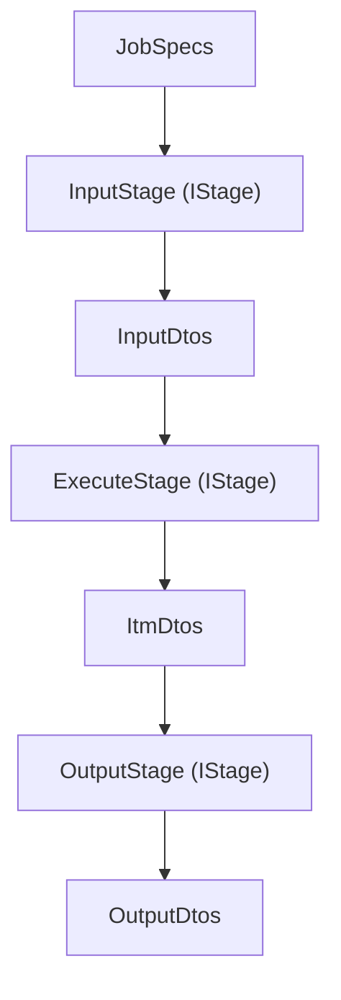

# シミュレーションロジック設計 - Pipelineコンポーネント

## 概要

本ドキュメントは、本シミュレーションエンジンにおけるPipelineコンポーネント（`src/im_cable_system/engine/pipeline/`）の構成と設計方針を定義する。
全体のレイヤー構造およびコンポーネント間の依存関係は `0_component.md` を参照する。

## Pipelineコンポーネントの役割

シミュレーションパイプラインの制御・実行管理を行う。

### 主な責務

- パイプライン全体の実行制御
- 各ステージの実行順序制御
- パイプライン設定の管理
- パイプライン固有のエラーハンドリング

## パイプライン構造とインターフェイス

Pipelineコンポーネントは、Processorコンポーネントが提供する `IStage` 系インターフェイスを用いて、
Input/Execute/Output 各ステージを組み立て、設定に応じた順序で実行する。

**引数・戻り値の方針**: Pipeline層および各ステージのインターフェイスでは、引数・戻り値ともに **Dtos** を想定する。生データやドメインオブジェクトを直接受け渡しせず、入出力はすべてDtosで統一する。

共通インターフェイスは `IPipeline[PipelineInputT, OutputDtosT]`（`i_pipeline.py`）で、次の契約を持つ。

- `create(config, logger) -> IPipeline[...]`: ステージを組み立てて注入するファクトリー。
- `run(input) -> OutputDtos`: 実行時入力（実行モードごとのジョブ仕様。例: `ForwardJobSpecs`）を受け取り、出力 DTO コレクションを返す。
- 内部で各ステージを **IStage** として保持し、Dtos の受け渡しでフローを制御する。ステージ種別は `IStage[ForwardJobSpecs, InputDtos]` などの型パラメータで区別する。
- 実行モードごとに具体パイプライン（`forward_by_cartesian_grid_pipeline.py` など）を用意し、入力型が異なる場合はクラスを分ける。

Pipelineはあくまでステージの組み立てと実行順序の制御に責務を限定し、個々の計算ロジックやモデル構築は
Processor/Algorithm/Domainに委譲する。

### Dtosフローのイメージ

Simulationパイプライン内でのDtosフローは、次のように整理される。



各ステージの入出力Dtosの詳細構造については [`shared/dto_principle.md`](./shared/dto_principle.md) を、ステージの役割とインターフェイス（引数・戻り値はDtos）については `4_processor.md` を、ステージ内の具体的な処理内容については `3_algorithm.md` および Domain 各ドキュメントを参照する。

## 依存関係

Pipelineコンポーネントは以下のコンポーネントに依存する（詳細な依存図は `0_component.md` を参照）：

- **processor**: processorのインターフェイス（`IStage` 群など）に依存
- **algorithm**: algorithmのインターフェイスに依存（直接参照はしないが、processor経由で使用）
- **domain**: domainのインターフェイスに依存（直接参照はしないが、processor経由で使用）
- **shared**: sharedのDtos、ユーティリティ、設定に依存

### パッケージ構成（Pipeline層）

```text
src/im_cable_system/engine/pipeline/
├── __init__.py              … 公開パイプラインクラス（__all__）
└── *_pipeline.py            … 各ジョブ用実装
```

**インポート**: [`docs/rules/layering_and_imports.md`](../rules/layering_and_imports.md) を参照する。
