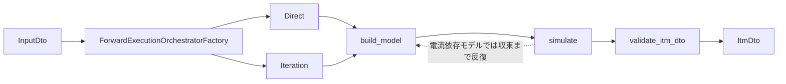

# Executeアルゴリズムデータフロー

## 概要

Execute アルゴリズムは、単一の `InputDto` を受け取り、モデル構築・シミュレーション・検証を実行して `ItmDto` を返す。Processor 層は `InputDtos` の分配と集約だけを担当し、1 DTO 内の計算順序は Algorithm 層に閉じ込める。

詳細な責務境界は [`2_component.md`](./2_component.md)、設計判断の理由は [`3_design_principles.md`](./3_design_principles.md) を参照。

## forward の流れ

forward は slip / frequency / input_line_voltage が既知の順計算である。電流依存モデルを含まない場合は Direct 実装が 1 回の `build_model -> simulate -> validate_itm_dto` で完了する。電流依存モデルを含む場合は Iteration 実装が、前回のシミュレーション電流を次回のモデル構築へ渡し、線電流が収束するまで `build_model <-> simulate` を繰り返す。

## 3 ステップの役割

- `build_model`: 入力 DTO と系列 DTO から、IM・ケーブル・システムの等価回路モデルを構築する。
- `simulate`: 構築済みモデルを使い、電圧電流・電力・特性値を計算する。
- `validate_itm_dto`: 計算が完了した `ItmDto` に対して、物理制約や設定上の許容範囲を確認する。

この順序は固定である。上位層が各ステップを個別に呼び出さないようにすることで、計算順序の誤りや検証漏れを防ぐ。

## パラメータ推定

`EstimateParams` は forward とは別インターフェースのオーケストレーターとして扱う。目標パフォーマンスカーブに合わせてパラメータを推定し、候補パラメータで forward 相当の `ItmDto` を評価する。

カタログ曲線と等価回路モデルの自由度の不整合、残差重みの考え方は [`estimate_params_curve_fitting_consistency.md`](./estimate_params_curve_fitting_consistency.md) を参照。
