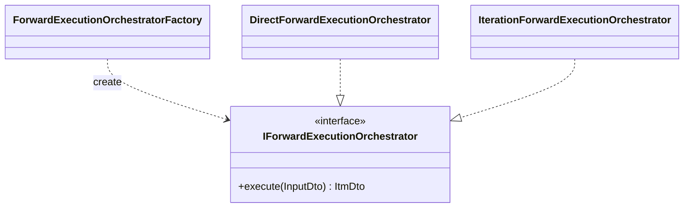

# Executeアルゴリズムコンポーネント

## 概要

この文書は、Execute アルゴリズムの主要コンポーネントと責務境界を示す。実装クラスやメソッドの詳細はコードを正とし、ここでは上位層が依存してよい入口と、変更時に守るべき分離だけを記載する。

- データフロー: [`1_data_flow.md`](./1_data_flow.md)
- 設計方針: [`3_design_principles.md`](./3_design_principles.md)
- 共通 Algorithm 設計: [`../../3_algorithm.md`](../../3_algorithm.md)

## 公開入口

forward の公開入口は `IForwardExecutionOrchestrator` である。Processor 層はこのインターフェースを通じて単一 `InputDto` の計算を依頼し、`ItmDto` を受け取る。

`ForwardExecutionOrchestratorFactory` は、入力 DTO の IM / ケーブルモデルに電流依存要素が含まれるかで Direct / Iteration を選択する。呼び出し側は具象実装を意識しない。

## forward オーケストレーター

forward オーケストレーターの責務は、1 本の `InputDto` に対する次の処理を一貫して実行することである。

1. `build_model`: IM・ケーブル・システムの等価回路モデルを構築する。
2. `simulate`: 電圧電流・電力・特性値を計算する。
3. `validate_itm_dto`: 計算済み `ItmDto` の物理的・設定的な妥当性を確認する。

Direct 実装はこの 3 ステップを 1 回ずつ実行する。Iteration 実装は、電流依存イミタンスを含む場合に `build_model` と `simulate` を収束まで反復し、最後に検証を行う。

## 下位コンポーネント

Execute 内部は、役割ごとに以下のまとまりに分かれる。

- **BuildModel**: 入力 DTO と系列 DTO から、計算に使う等価回路モデル DTO を構築する。モデルタイプごとの差分は Builder / Factory 側に閉じ込める。
- **Simulation**: 構築済みモデルから、電圧電流、電力、回転速度・トルク・効率などの特性値を計算する。計算順序はオーケストレーターが固定する。
- **Validation**: 計算自体が完了した結果に対し、エネルギー保存、電流電圧レンジ、特性値の整合性などを設定に応じて確認する。
- **EstimateParams**: カタログ性能カーブを目標にパラメータを推定する。forward とは別インターフェースだが、候補値の評価では forward 相当の計算結果を利用する。

## 境界の考え方

Processor 層から見える Algorithm 層は「1 DTO を受け取り 1 DTO を返す黒箱」である。`build_model` や `simulate` を Processor 層から個別に呼び出さないことで、Pipeline / Processor が計算順序や検証有無を知る必要をなくす。

新しいモデルタイプを追加する場合は、Processor 層ではなく Algorithm 層の Builder / Calculator / Factory の拡張で吸収する。新しい処理方式（逐次・並列など）は Processor 層の Strategy で扱い、Algorithm 層の計算コンポーネントには持ち込まない。
