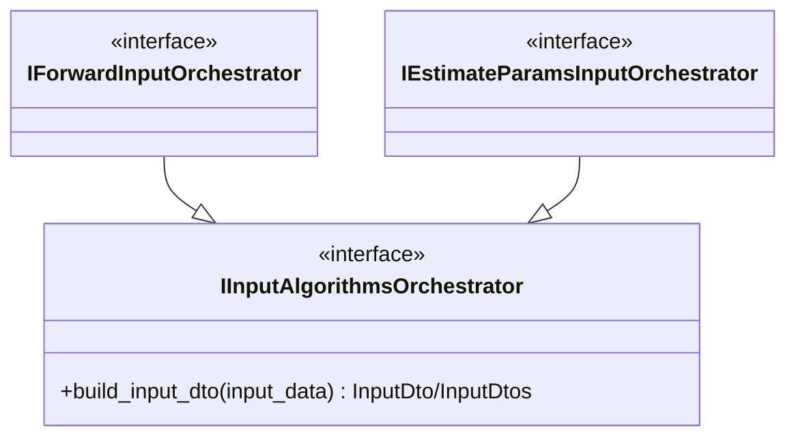

# Inputアルゴリズムコンポーネント

## 概要

この文書は、Input アルゴリズムの主要コンポーネントと責務境界を示す。実装クラスやメソッドの詳細はコードを正とし、ここでは上位層が依存してよい入口と、段ごとの責務分担だけを記載する。

- データフロー: [`1_data_flow.md`](./1_data_flow.md)
- 設計前提: [`3_design_principles.md`](./3_design_principles.md)
- 共通 Algorithm 設計: [`../../3_algorithm.md`](../../3_algorithm.md)

## 公開入口

Input の公開入口は、実行モードごとのオーケストレーターインターフェースである。Processor 層 InputStage は、モードに対応する窓口（`orchestrate.forward` / `orchestrate.estimate_params`）からインターフェースを受け取り、`build_input_dto` を呼ぶ。

共通インターフェース `IInputAlgorithmsOrchestrator` は 4 段の呼び出し順を契約として共有する。ただし生成（`create`）に必要な引数はモードで異なる（forward は `reference_axes` が必要、estimate_params は不要）ため、`create` は共通インターフェースに置かず、モード別インターフェースに置く。共通インターフェースは層外へ公開しない。

## オーケストレーター

オーケストレーターの責務は、4 段フローを固定順で呼び出すことである。各段の実処理は、注入された Loader / Assembler / Validator に委譲する。

- **ForwardInputOrchestrator**: `ForwardJobSpec` から単一 `InputDto` を構築する。モード分岐は持たず、`reference_axes` を Assembler へ渡すだけにする。
- **EstimateParamsInputOrchestrator**: 統合 TSV から `InputDtos` を構築する。複数件の組み立て・検証ループはここで持つ。

## 下位コンポーネント

各段の実処理は、役割ごとに次のコンポーネントへ分かれる。

- **JobSpecValidator**: ロード前の軽量チェック（パス存在、必須フィールドの非空など）を担う。
- **Loader**: ファイルをパースして `LoadedData` を構築する。estimate_params では候補直積への展開もここで行う。
- **Assembler**: `LoadedData` から `InputDto` を組み立てる。単位正規化や DTO 構築をまとめる。
- **InputDtoValidator**: 組み立て済み DTO の構造・単位・横断整合・物理関係式を検証する。

## 境界の考え方

Processor 層から見える Input は「ジョブ仕様を渡すと検証済みの `InputDto` / `InputDtos` が返る黒箱」である。各段の中間表現（`LoadedData` など）は Input 内部に閉じ込め、層外へは公開しない。

新しい入力形式や新しいモードを追加する場合は、対応するモード別オーケストレーターと Loader / Assembler / Validator の組を追加し、Processor 層には公開窓口経由でモード別インターフェースだけを見せる。
