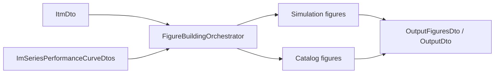

# Outputアルゴリズムデータフロー

## 概要

Output アルゴリズムは、`ItmDto` とカタログ性能カーブを受け取り、図表 DTO を組み立てる。Processor 層 OutputStage の流れは [`../../4_processor.md`](../../4_processor.md) を参照。

## データフロー

1. Execute により `ItmDto` が構築される。
2. Output は `ItmDto.model.array_layout` の参照軸を確認する。
3. `slip`, `frequency`, `input_line_voltage` の軸から、条件ごとの slip 方向スライスを取得する。
4. シミュレーション結果から slip 軸・出力比軸の性能カーブを作る。
5. カタログ性能カーブがある場合は、同じ軸の図表 DTO へ変換する。
6. 生成した図表 DTO を `OutputFiguresDto` としてまとめる。

## 出力される図表

- slip 軸性能カーブ: slip に対する出力、入力電流、力率、効率。
- 出力比軸性能カーブ: 出力比に対する回転数、電流率、効率、力率。
- カタログ slip 軸カーブ: カタログ値を slip 軸で比較するための図表。
- カタログ出力比軸カーブ: カタログ値を出力比軸で比較するための図表。

Output は図表 DTO の構築までを責務とし、どの形式で保存・表示するかは呼び出し側または Export 側の責務とする。
