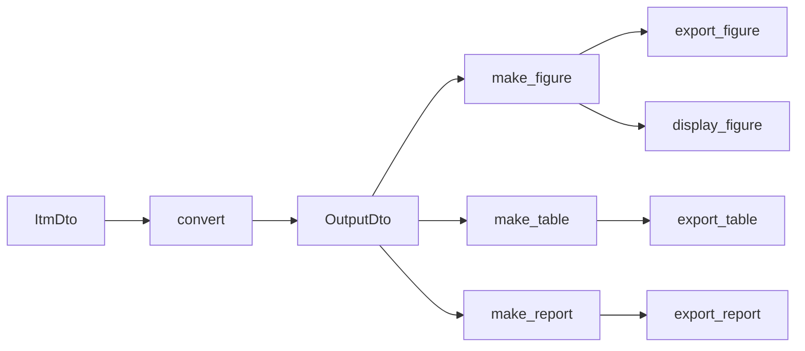

# Outputアルゴリズムデータフロー

## 概要

Output アルゴリズムは、単一 `ItmDto` を受け取り、`run` を入口として `OutputDto` を返す。
図・表・レポートは戻り値ではなくファイルへの side effect として出力する。
Processor 層 OutputStage の流れは [`../../4_processor.md`](../../4_processor.md) を参照。

詳細な責務境界は [`2_component.md`](./2_component.md)、設計判断の理由は
[`3_design_principles.md`](./3_design_principles.md) を参照。

## 共通フロー

1. `convert`: `ItmDto` から `OutputDto` を構築する（`IOutputDtoConverter.convert`）。
   以降のすべてのステップは `OutputDto` だけを入力とする。
2. `make_figure`: `OutputDto` から matplotlib `Figure` を組み立てる
   （`IFigureBuilder.build`）。
3. `make_table`: `OutputDto` から pandas `DataFrame` を組み立てる
   （`ITableBuilder.build`）。
4. `make_report`: `OutputDto` から `ReportDto` を組み立てる
   （`IReportBuilder.build`。EstimateParams のみ。フィット要約が無ければ `None`）。
5. `export_figure` / `display_figure` / `export_table` / `export_report`:
   生成した artifact を保存・表示する。

最後に `convert` で得た `OutputDto` をそのまま返す。

## config による個別ゲート

各出力は config で**個別**に判定する。build 自体を省略できるため、
無効化した出力の計算コストは発生しない。

| 出力 | 判定キー |
|---|---|
| 図の保存 | `dump.output.figures.enabled` |
| 図の表示 | `calculation.output.figures.show` |
| 表の保存 | `dump.output.tables.enabled` |
| レポートの保存 | `dump.output.reports.enabled`（EstimateParams のみ） |

図は「保存 or 表示のどちらかが有効なとき」だけ build し、**同一 `Figure`
オブジェクト**を保存と表示の両方へ渡す。保存・表示のあとは `finally` で必ず
`plt.close(figure)` する（保存のみの経路でも matplotlib のメモリリークを防ぐ）。

## モード別の流れ

- **ForwardByCartesianGrid**: 図種別（`slip_axis` / `output_ratio_axis`）ごとに
  Builder を持ち、種別ラベル付きでループして build・保存する。
- **ForwardByOperatingPoints**: 図は 1 種のみ（`operating_points`）。build も 1 回。
- **EstimateParams**: ForwardByCartesianGrid と同じ図・表に加え、`ReportDto` を
  1 件組み立て、3 つの artifact exporter（フィット要約 CSV / catalog YAML /
  数値安定化 CSV）へ順に渡す。`ReportDto` が `None` なら何も保存しない。

Itm 横断の集計を要さないため、レポートも他の出力と同じく per-itm
（1 `ItmDto` = 1 ファイル）で `run()` 内に閉じる。
