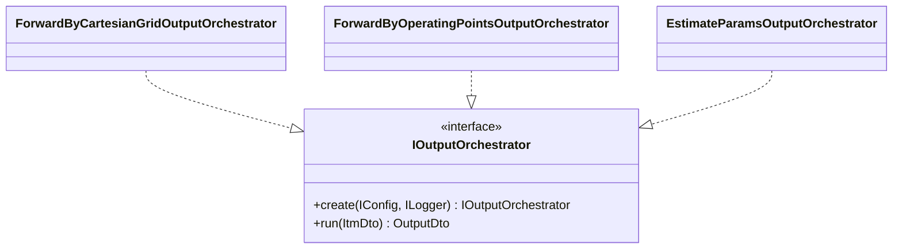

# Outputアルゴリズムコンポーネント

## 概要

この文書は、Output アルゴリズムの主要コンポーネントと責務境界を示す。実装クラスや
メソッドの詳細はコードを正とし、ここでは上位層が依存してよい入口と、ステップ間の
分離だけを記載する。

- データフロー: [`1_data_flow.md`](./1_data_flow.md)
- 設計方針: [`3_design_principles.md`](./3_design_principles.md)
- 共通 Algorithm 設計: [`../../3_algorithm.md`](../../3_algorithm.md)

## 公開入口

Output の公開入口は `IOutputOrchestrator` である。層外（Processor / Pipeline）から
見える出力アルゴリズムの契約はこの 1 つだけで、具象はモード別に
`orchestrate/` サブパッケージへ置く。

Input / Execute と異なり、実装を選ぶ Factory は持たない。モードごとに Pipeline が
分かれており、選択時点でモードが確定するため、対応するオーケストレーターの
`create` を直接呼ぶ。

## ステップのインターフェース

オーケストレーターは、注入された各ステップへ処理を委譲する。すべてのステップは
`create(config, logger)` で生成し、`OutputDto` を入力とする（`convert` のみ `ItmDto`）。

| ステップ | インターフェース | 契約 |
|---|---|---|
| convert | `IOutputDtoConverter` | `convert(ItmDto) -> OutputDto` |
| make_figure | `IFigureBuilder` | `build(OutputDto) -> Figure` |
| make_table | `ITableBuilder` | `build(OutputDto) -> DataFrame` |
| make_report | `IReportBuilder` | `build(OutputDto) -> ReportDto \| None` |
| export_figure | `IFigureExporter` | `export(figure, output_dto, kind) -> None` |
| display_figure | `IFigureDisplayer` | `show(figure, output_dto) -> None` |
| export_table | `ITableExporter` | `export(table, output_dto) -> None` |
| export_report | `IReportArtifactExporter` | `export(report) -> None` |

## Builder の実装

図・表の差分は Builder の実装に閉じ込める。形状（supply_grid / operating_points）
ごとにサブパッケージを分ける。

**make_figure**

- `SupplyGridSlipAxisFigureBuilder`: (f, V) をサブプロット軸、slip を横軸とし、
  力率 / 線電流の大きさ / 出力 / 効率 / トルクを描く。
- `SupplyGridOutputRatioFigureBuilder`: (f, V) をサブプロット軸、出力比 [%] を
  横軸とし、電流比 [%] / 回転数 [rpm] / 力率 [%] / 効率 [%] を描く。参照カタログが
  同じ (f, V) 条件にあれば破線で重ね描きする。
- `OperatingPointsFigureBuilder`: 運転点（リスト番号）を横軸に、回転数 / 電流 /
  電圧 / 周波数 / 出力 / トルク / 効率 / 力率を、スケール差を保つよう複数の
  縦軸へ分けて描く。

**make_table**

- `SupplyGridTableBuilder`: 参照軸直積（slip × (V, f)）を 1 行 1 点の long 形式へ
  展開する。カタログがあれば `catalog_` 接頭の参照列を右側へ追加する。
- `OperatingPointsTableBuilder`: 運転点を 1 行 1 点で並べる。`array_layout` に
  無い供給条件軸の列は省く。

## レポート（EstimateParams 専用）

`make_report` は `ReportDto` を組み立て、`export_report` の 3 つの exporter が
それぞれの形式へ直列化する。

- `FitSummaryCsvExporter`: 最適化要約・適合指標・推定パラメータ。
- `FittedCatalogYamlExporter`: 推定モデルを catalog 形式の入れ子マッピングで出力。
- `NumericalStabilityCsvExporter`: 数値安定化イベント集計。catalog YAML には
  含めず専用 CSV へ分ける（重複回避）。

CSV のレイアウト（行整形）は `export_report` の責務であり、`ReportDto` は意味の
ある数値・構造データだけを保持する。

## 境界の考え方

Processor 層から見える Output は「`ItmDto` を渡すと `OutputDto` が返り、必要な
ファイルが書き出される黒箱」である。図・表・レポートの中間 artifact
（`Figure` / `DataFrame` / `ReportDto`）は Output 内部に閉じ込め、層外へは
公開しない。

新しい出力形式を追加する場合は、対応する Builder / Exporter を足してモード別
オーケストレーターへ配線する。Processor 層には `IOutputOrchestrator` だけを
見せる。

> **NOTE**: モード別オーケストレーターは `run` とゲート判定の実装が重複するが、
> 出力モードごとに独立させる方針のため、意図的に共通化していない
> （実装の `NOTE:` コメントも参照）。
