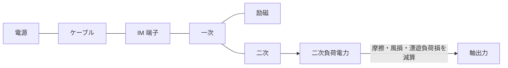

# 等価回路モデル

本エンジンが計算する対象は、電源・ケーブル・誘導電動機（IM）を直列に繋いだ等価回路である。

IM は一次・励磁・二次の 3 枝。摩擦・風損と漂遊負荷損はイミタンスを持たず、二次負荷電力から差し引いて軸出力にする。

## 読む順

1. このページ（回路の構成）
2. [calculation.md](./calculation.md) — 計算の流れ
3. [equations/index.md](./equations/index.md) — モデル種別ごとの数式・YAML キー・実装
4. [curve_fitting_consistency.md](./curve_fitting_consistency.md) — カタログ曲線への当てはめ
